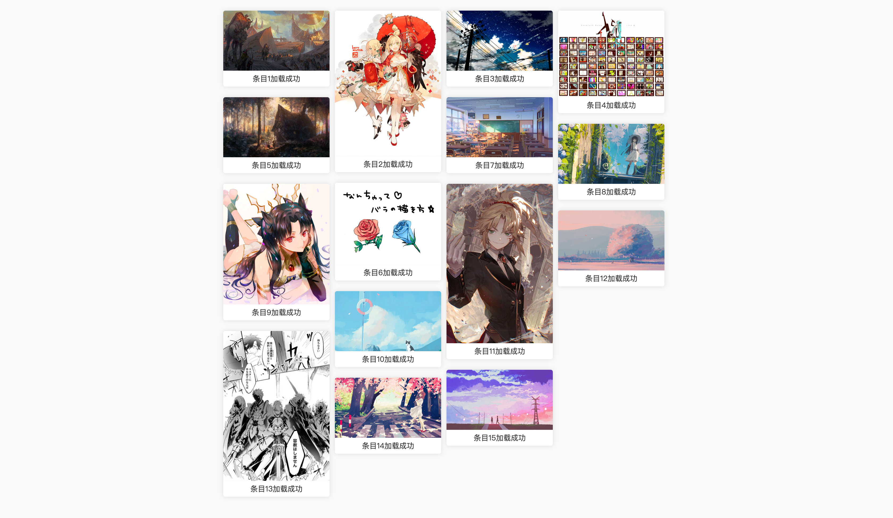

## JS瀑布流

js实现瀑布流布局  
> 监听每一张图片的加载，同时更新当前位置，父元素保持和元素等高（手动清楚了浮动）  

## 用法
```
<!-- 准备html (样式自己写 class 也可以自定义)-->
<main id="app">
	<div class="item">
		
		<p>条目1加载成功</p>
	</div>
	<div class="item">
		
		<p>条目2加载成功</p>
	</div>
	<div class="item">
		
		<p>条目3加载成功</p>
	</div>
</main>
<!--  引入 waterfall.js  -->

<script src="../js/waterfall.js"></script>

<script>
	// 实例化WaterFallList
	new WaterFallList({
		// 根元素
		el:"#app",
		count: 4,
	}).render();
</script>

```


## 展示


